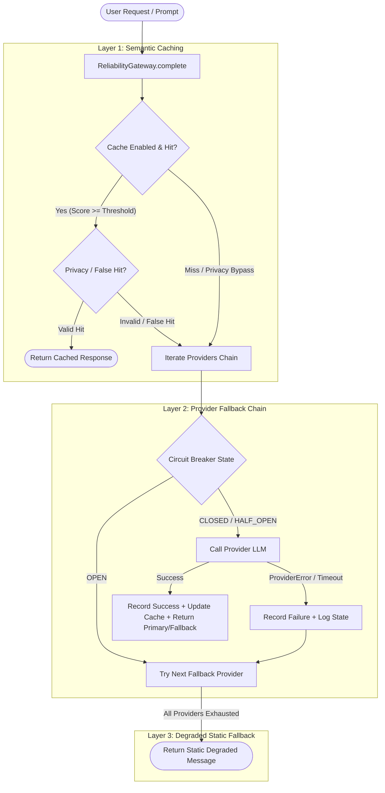

# 🏗️ TỔNG QUAN KIẾN TRÚC & CÁC KHÁI NIỆM NỀN TẢNG (RELIABILITY AGENT LAB)

---

## 1. Giới thiệu & Mục tiêu Bài Lab (Objectives)

Bài Lab **Day 25 Track 3: Reliability Engineering for Production Agents** yêu cầu xây dựng một tầng đảm bảo độ tin cậy (Reliability Layer) chuẩn production dành cho LLM Agent Gateway.

### Mục tiêu học tập cốt lõi (Core Learning Goals):
1. **Thiết kế Máy trạng thái Circuit Breaker (3-State Machine)**: `CLOSED` $\rightarrow$ `OPEN` $\rightarrow$ `HALF_OPEN` $\rightarrow$ `CLOSED`, chống bão thử lại (retry storms) và bảo vệ dịch vụ phía sau (downstream providers).
2. **Xây dựng Chuỗi điều hướng thông minh (Smart Routing Pipeline)**: Luồng xử lý phân tầng: `Cache` $\rightarrow$ `Circuit Breaker (Primary Provider)` $\rightarrow$ `Fallback Providers` $\rightarrow$ `Static Degraded Response`.
3. **Bộ đệm ngữ nghĩa thông minh (Semantic Cache & Guardrails)**: Sử dụng độ tương đồng Cosine trên N-gram ký tự kết hợp token từ, kiểm soát quyền riêng tư (Privacy Guardrails: PII/SSN/Credit Card bypass cache) và phát hiện trùng lặp giả (False-Hit Detection trên mốc thời gian/con số).
4. **Bộ nhớ đệm phân tán chia sẻ qua Redis (Shared Redis Cache)**: Triển khai lưu trữ đệm phân tán hỗ trợ triển khai multi-instance.
5. **Kỹ nghệ hỗn loạn & Khả năng quan sát (Chaos Engineering & Observability)**: Chạy mô phỏng lỗi (latency spike, error injection, intermittent failure), đo lường các chỉ số then chốt: Availability %, Error Rate %, P50/P95/P99 Latency, Cache Hit Rate, Cost Saved, Recovery Time (MTTR).
6. **Báo cáo định lượng thực nghiệm (Evidence-based Report)**: Báo cáo kỹ thuật được trích xuất hoàn toàn từ số liệu thực nghiệm.

---

## 2. Kiến trúc Hệ thống & Luồng Dữ liệu (System Architecture & Data Flow)

---

## 3. Các Khái niệm Kỹ thuật Then chốt (Core Technical Concepts)

### 3.1. Circuit Breaker 3-State Machine
- **`CLOSED` (Đóng)**: Hoạt động bình thường. Tất cả request được chuyển tới Provider. Nếu số lỗi liên tiếp vượt ngưỡng `failure_threshold`, chuyển sang trạng thái `OPEN`.
- **`OPEN` (Mở)**: Provider đang gặp sự cố. Toàn bộ request bị chặn ngay lập tức (`CircuitOpenError`) nhằm bảo vệ hệ thống và tránh retry storm. Sau khoảng thời gian chờ `reset_timeout_seconds`, chuyển sang trạng thái `HALF_OPEN`.
- **`HALF_OPEN` (Nửa mở)**: Trạng thái thăm dò (Probe). Cho phép số ít request đi qua:
  - Nếu request thăm dò thành công liên tiếp đạt `success_threshold` $\rightarrow$ Chuyển về `CLOSED`.
  - Nếu có bất kỳ lỗi nào xảy ra trong giai đoạn thăm dò $\rightarrow$ Lập tức quay lại `OPEN` với lý do `probe_failure` (không cần đợi đủ threshold).

### 3.2. Semantic Cache với N-gram Cosine & Guardrails
- **Tính toán tương đồng (Similarity)**: Kết hợp Word Tokens và Character 3-Grams, chuyển đổi thành vector tần số (`Counter`) và tính Cosine Similarity:
  $$\text{Cosine}(A, B) = \frac{A \cdot B}{\|A\| \times \|B\|}$$
- **Privacy Guardrails**: Các truy vấn chứa thông tin nhạy cảm (SSN, Số thẻ tín dụng, Mật khẩu, API key, PII) tuyệt đối không được đọc hoặc lưu vào Cache để đảm bảo tuân thủ bảo mật (GDPR / HIPAA).
- **False-Hit Detection**: Phát hiện các câu hỏi cấu trúc giống nhau nhưng khác biệt về ngữ nghĩa cốt lõi (ví dụ: *"Doanh thu quý 1 năm 2023"* vs *"Doanh thu quý 1 năm 2024"*). Tránh trả về dữ liệu sai lệch cho người dùng.

### 3.3. Multi-Instance Distributed Caching (Redis)
- Hỗ trợ lưu trữ đệm phân tán thông qua `SharedRedisCache`.
- Quản lý vòng đời cache với `TTL`, hỗ trợ tra cứu chính xác theo hash (`HSET`/`HGET`) và quét độ tương đồng (`SCAN_ITER`).

### 3.4. Chaos Simulation & Observability
- Khảo sát sức chịu tải và khả năng tự phục hồi của hệ thống với các kịch bản:
  - *Baseline*: Mọi provider hoạt động ổn định.
  - *Provider Outage*: Provider chính sập hoàn toàn (100% fail), hệ thống tự kích hoạt Circuit Breaker và chuyển sang Fallback Provider mượt mà.
  - *Intermittent Flapping / High Latency*: Provider chập chờn, kiểm tra độ nhạy của Breaker và độ trễ P95/P99.
- **Chỉ số đo lường (Metrics)**:
  - Availability (%)
  - P50, P95, P99 Latency (ms)
  - Cache Hit Rate (%) & Cost Savings ($)
  - Mean Time to Recover (MTTR - ms)

---

## 4. Tham chiếu Mã nguồn & Cấu trúc Dự án

| Module | Tệp nguồn | Nhiệm vụ chính | Unit Tests |
|---|---|---|---|
| **Circuit Breaker** | [`circuit_breaker.py`](file:///d:/tai%20lieu%20hoc%20tap/VinAI/Day25/Lap/K3-Day25-Track3-Reliability-Agent/src/reliability_lab/circuit_breaker.py) | Máy trạng thái 3 pha, đếm lỗi/thành công, nhật ký chuyển đổi | [`test_circuit_breaker.py`](file:///d:/tai%20lieu%20hoc%20tap/VinAI/Day25/Lap/K3-Day25-Track3-Reliability-Agent/tests/test_circuit_breaker.py) (11 tests) |
| **Response Cache** | [`cache.py`](file:///d:/tai%20lieu%20hoc%20tap/VinAI/Day25/Lap/K3-Day25-Track3-Reliability-Agent/src/reliability_lab/cache.py) | N-gram cosine similarity, TTL, Privacy, False-hit, Redis Backend | [`test_cache.py`](file:///d:/tai%20lieu%20hoc%20tap/VinAI/Day25/Lap/K3-Day25-Track3-Reliability-Agent/tests/test_cache.py) (9 tests), [`test_redis_cache.py`](file:///d:/tai%20lieu%20hoc%20tap/VinAI/Day25/Lap/K3-Day25-Track3-Reliability-Agent/tests/test_redis_cache.py) (6 tests) |
| **Gateway** | [`gateway.py`](file:///d:/tai%20lieu%20hoc%20tap/VinAI/Day25/Lap/K3-Day25-Track3-Reliability-Agent/src/reliability_lab/gateway.py) | Định tuyến luồng: Cache $\rightarrow$ Breaker $\rightarrow$ Fallback $\rightarrow$ Static | [`test_gateway_contract.py`](file:///d:/tai%20lieu%20hoc%20tap/VinAI/Day25/Lap/K3-Day25-Track3-Reliability-Agent/tests/test_gateway_contract.py) (4 tests) |
| **Chaos & Metrics** | [`chaos.py`](file:///d:/tai%20lieu%20hoc%20tap/VinAI/Day25/Lap/K3-Day25-Track3-Reliability-Agent/src/reliability_lab/chaos.py), [`metrics.py`](file:///d:/tai%20lieu%20hoc%20tap/VinAI/Day25/Lap/K3-Day25-Track3-Reliability-Agent/src/reliability_lab/metrics.py) | Chạy kịch bản tải, đo lường recovery time, xuất báo cáo CSV/JSON | [`test_metrics.py`](file:///d:/tai%20lieu%20hoc%20tap/VinAI/Day25/Lap/K3-Day25-Track3-Reliability-Agent/tests/test_metrics.py), `run_chaos.py` |
