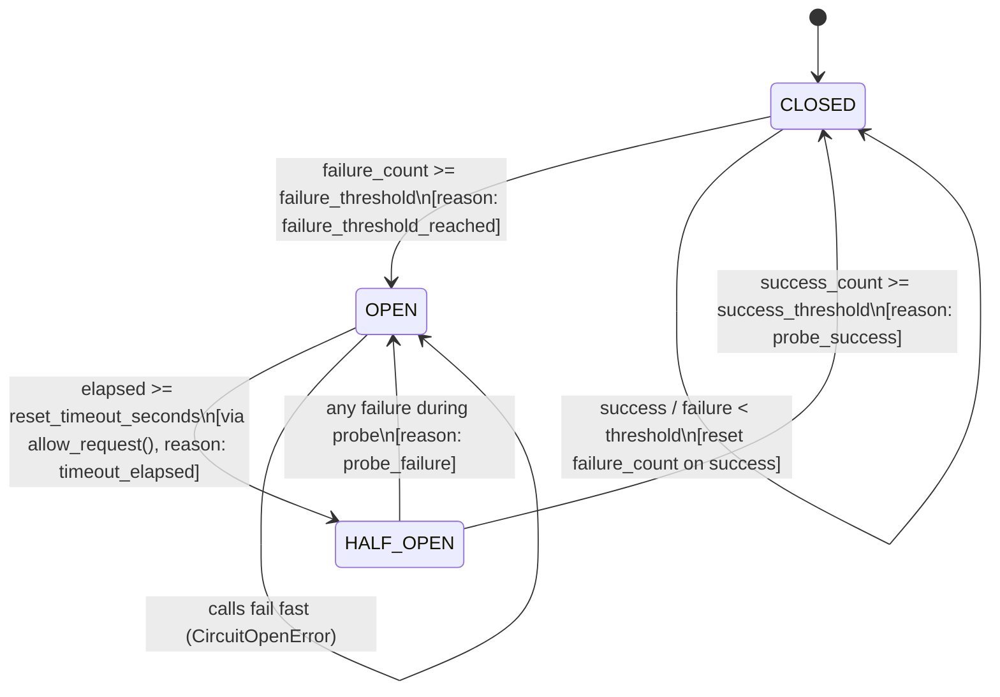

# 🛡️ PHÂN TÍCH KỸ THUẬT: MODULE CIRCUIT BREAKER (PHASE 1)

---

## 1. Mục tiêu & Hiện trạng Mã nguồn

### 1.1. Hiện trạng
- Tệp mã nguồn: [`src/reliability_lab/circuit_breaker.py`](file:///d:/tai%20lieu%20hoc%20tap/VinAI/Day25/Lap/K3-Day25-Track3-Reliability-Agent/src/reliability_lab/circuit_breaker.py)
- Bộ test suite liên quan: [`tests/test_circuit_breaker.py`](file:///d:/tai%20lieu%20hoc%20tap/VinAI/Day25/Lap/K3-Day25-Track3-Reliability-Agent/tests/test_circuit_breaker.py) (11 tests đang FAIL), [`tests/test_todo_requirements.py:L41-60`](file:///d:/tai%20lieu%20hoc%20tap/VinAI/Day25/Lap/K3-Day25-Track3-Reliability-Agent/tests/test_todo_requirements.py#L41-L60) (2 xfail tests).
- Điểm Rubric mục tiêu: **25/25 điểm**.

---

## 2. Kiến trúc Máy trạng thái 3 Pha (3-State Machine)

---

## 3. Thiết kế Chi tiết Từng Phương Thức

### 3.1. `allow_request(self) -> bool`
- **Mục đích**: Cổng gác kiểm tra request có được phép thực thi hay không.
- **Logic**:
  1. `if self.state == CircuitState.CLOSED`: Trả về `True`.
  2. `if self.state == CircuitState.HALF_OPEN`: Trả về `True` (cho phép request thăm dò).
  3. `if self.state == CircuitState.OPEN`:
     - Kiểm tra nếu `self.opened_at is not None` và `time.monotonic() - self.opened_at >= self.reset_timeout_seconds`:
       - Chuyển trạng thái sang `CircuitState.HALF_OPEN` với lý do `"timeout_elapsed"`.
       - Trả về `True`.
     - Ngược lại: Trả về `False` (Fail-fast).

### 3.2. `call(self, fn: Callable[..., T], *args: object, **kwargs: object) -> T`
- **Mục đích**: Wrapper bọc ngoài lời gọi hàm thực thi tới Provider.
- **Logic**:
  1. Kiểm tra `if not self.allow_request()`: Ném ra ngoại lệ `CircuitOpenError(f"Circuit '{self.name}' is OPEN")`.
  2. Khối `try`:
     - Gọi `result = fn(*args, **kwargs)`.
     - Ghi nhận thành công: `self.record_success()`.
     - Trả về `result`.
  3. Khối `except Exception`:
     - Ghi nhận thất bại: `self.record_failure()`.
     - Re-raise lại exception ban đầu (`raise`).

### 3.3. `record_success(self) -> None`
- **Mục đích**: Cập nhật bộ đếm khi request thực thi thành công.
- **Logic**:
  1. Đặt lại `self.failure_count = 0`.
  2. Tăng `self.success_count += 1`.
  3. Nếu đang ở trạng thái `CircuitState.HALF_OPEN` và `self.success_count >= self.success_threshold`:
     - Chuyển trạng thái sang `CircuitState.CLOSED` với lý do `"probe_success"`.
     - Đặt lại `self.success_count = 0`.

### 3.4. `record_failure(self) -> None`
- **Mục đích**: Cập nhật bộ đếm khi request bị lỗi hoặc ngoại lệ.
- **Bẫy kỹ thuật bắt buộc (Critical Pitfall)**:
  - Phải dùng cấu trúc `if / elif` phân nhánh độc lập, tuyệt đối KHÔNG gộp chung bằng toán tử `or`.
- **Logic**:
  1. Tăng `self.failure_count += 1`.
  2. Đặt lại `self.success_count = 0`.
  3. `if self.state == CircuitState.HALF_OPEN`:
     - Ngay lập tức chuyển sang `CircuitState.OPEN` với lý do `"probe_failure"`.
     - Cập nhật `self.opened_at = time.monotonic()`.
  4. `elif self.failure_count >= self.failure_threshold`:
     - Chuyển sang `CircuitState.OPEN` với lý do `"failure_threshold_reached"`.
     - Cập nhật `self.opened_at = time.monotonic()`.

---

## 4. Kế hoạch Kiểm thử & Tiêu chí Nghiệm thu
- Chạy lệnh: `uv run pytest tests/test_circuit_breaker.py -v`
- Mục tiêu: **11/11 Passed (100%)**.
