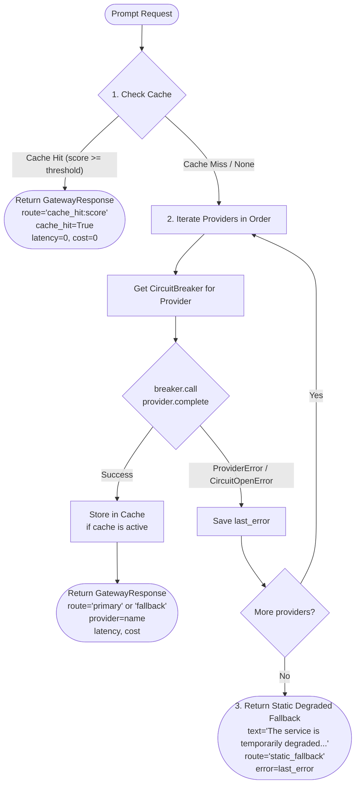

# 🚪 PHÂN TÍCH KỸ THUẬT: MODULE RELIABILITY GATEWAY (PHASE 3)

---

## 1. Mục tiêu & Hiện trạng Mã nguồn

### 1.1. Hiện trạng
- Tệp mã nguồn: [`src/reliability_lab/gateway.py`](file:///d:/tai%20lieu%20hoc%20tap/VinAI/Day25/Lap/K3-Day25-Track3-Reliability-Agent/src/reliability_lab/gateway.py)
- Bộ test suite liên quan: [`tests/test_gateway_contract.py`](file:///d:/tai%20lieu%20hoc%20tap/VinAI/Day25/Lap/K3-Day25-Track3-Reliability-Agent/tests/test_gateway_contract.py) (4 tests đang FAIL), [`tests/test_todo_requirements.py:L62-72`](file:///d:/tai%20lieu%20hoc%20tap/VinAI/Day25/Lap/K3-Day25-Track3-Reliability-Agent/tests/test_todo_requirements.py#L62-L72) (1 xfail test).
- Điểm Rubric mục tiêu: **25/25 điểm**.

---

## 2. Thiết kế Chi tiết Request Routing Pipeline

---

## 3. Quy chuẩn Thuộc tính Phản hồi (GatewayResponse Specs)

1. **Cache Hit**:
   - `route`: `f"cache_hit:{score:.2f}"`
   - `provider`: `None`
   - `cache_hit`: `True`
   - `latency_ms`: `0.0`
   - `estimated_cost`: `0.0`
2. **Primary Provider (Provider đầu tiên index 0)**:
   - `route`: `"primary"`
   - `provider`: `provider.name`
   - `cache_hit`: `False`
   - `latency_ms`: `resp.latency_ms`
   - `estimated_cost`: `resp.estimated_cost`
3. **Fallback Provider (Index > 0)**:
   - `route`: `"fallback"`
   - `provider`: `provider.name`
4. **Static Degraded Fallback (Toàn bộ thất bại)**:
   - `text`: `"The service is temporarily degraded. Please try again soon."`
   - `route`: `"static_fallback"`
   - `provider`: `None`
   - `error`: `last_error`

---

## 4. Kế hoạch Kiểm thử & Tiêu chí Nghiệm thu
- **Lệnh thực thi**: `uv run pytest tests/test_gateway_contract.py -v`
- **Mục tiêu**: **4/4 tests PASSED 100%**.
